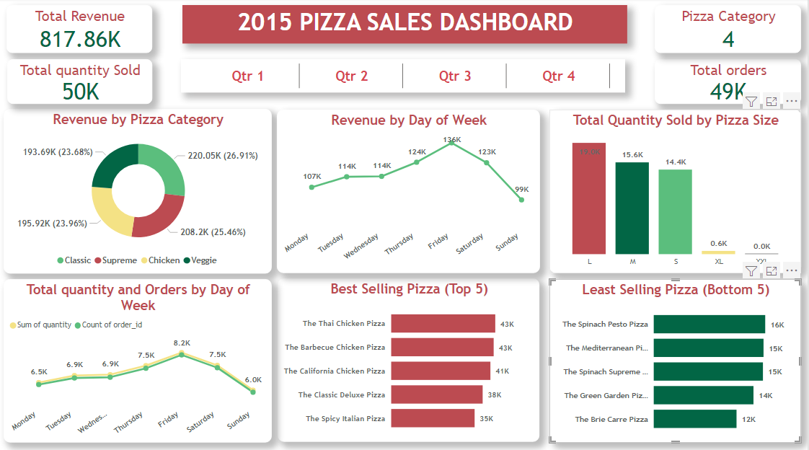

# Pizza sales Report (2015)

## INTRODUCTION

The dataset is a complete pizza order inventory in 2015 and it was provided to help make sense of the data and gain insights that can help move the company forward next year

The dataset contains four sheets, orders, order_details, pizza and pizza_types

The orders table contains information of the Date and time of each orders, the order_details contains information describing the detail of the order_ID this include the pizza_id, the quantity of pizza ordered and also the order_details_id

The pizza table contains the Pizza_id, which contains the type of pizza ordered by the customer, it contains the pizza_type_id, the size and price for each pizza type size

And lastly the pizza_types sheet, it contains the name of the pizza_type_id, the category, and the ingredients used

### SKILLS/CONCEPT DEMONSTRATED

Table Structuring, Data cleaning, powerQuery, Data Transformation, Query merging, Data analysis & visualization 

**PROBLEM STATEMENT**

The following insights were asked to be derived from the dataset 

- Total Revenue 
- Total orders made
- Number of pizza Category
- Total quantity 
- Revenue by category 
- Best selling Pizza (Top 5)
- Least selling Pizza (Bottom 5)
- Revenue trend by the day of the week 
- Orders and Quantities sold by day of the week
- Quantities sold by Pizza size

### DATA TRANSFORMATION AND CLEANING

The Data was structured in Excel and transformed in the powerquery editor of powerBi. The merging query technique was used to consolidate all four tables into one single table.  This was done using the primary key and foreign keys in each table to join each other. This transformed the orders column from 3 columns to 9 columns.
The data was saved and loaded into the visualization pane

### DATA visualization 

I ensured the design and color applied to the report were visually appealing and did not distort user's focus from the insight got from the visuals

The following questions were answered through visualization

**Revenue of pizza sales by cateogory**

From this visual we can see that no one category is outrightly the preferred over thw other categories, the revenue is quite spread out by the categories 

**Revenue by day of the week**

The sales keep rising right from Monday straight up to Friday(probably the thanks God is Friday effect) being the peak of sales and declines on Saturday and further on Sunday

**Total quantity sold by pizza size**

The most sold quantity by size is the large size followed by the medium and then the small size, both the extra large and extra extra large are not really preferred by the customers

**Total Quantity sold and orders by days of the week**

The total quantity sold and orders made by days of the weeks are in sync with each other, this shows that the delivery system is quite okay, only for a few orders not delivered and this can definitely be improved on.

